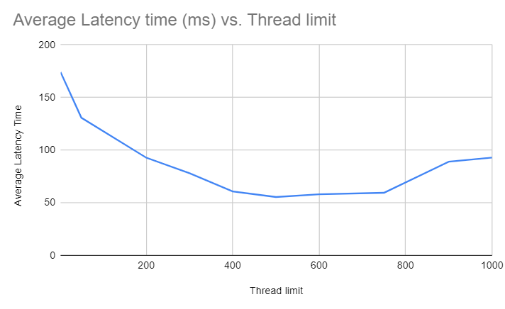
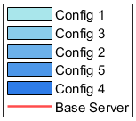
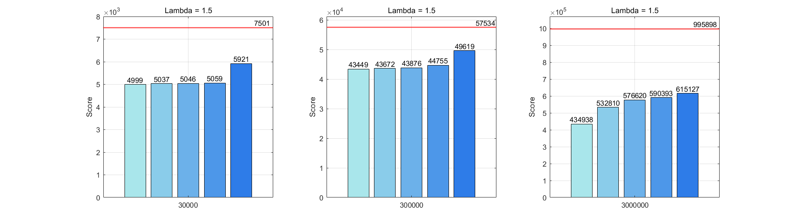
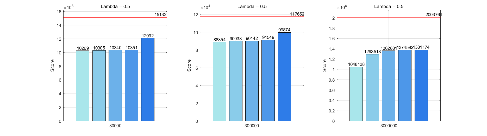
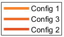
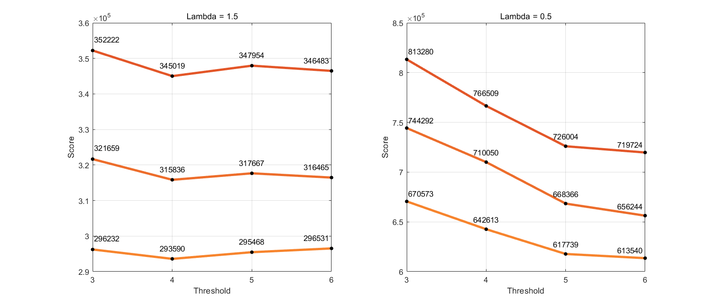

# OS Challenge (hello-world)

## Introduction
The OS Challenge is a group project that uses operating system concepts to optimize performance of a server for reverse hashing.
The challenge consists of developing a server application in the C programming language, and using system calls to optimize and streamline the application's performance.

## Final Solution
Our team conducted a series of experiments, with each team member contributing 1-2 experiments. After an in-depth examination of the experimental results, we collectively formulated a final solution incorporating several key features.

The proposed solution implements a multithreading model to enhance the efficiency and parallel processing capabilities of the system. A thread pool architecture has been employed, consisting of 8 threads, to manage and execute concurrent tasks effectively.

In order to prioritize tasks based on their urgency and importance, the system utilizes priority scheduling. This is implemented through the use of priority queues, ensuring that requests are processed in an order sorted by their priority levels.

To optimize memory management, a second-chance page replacement algorithm has been adopted. This algorithm involves maintaining an array of size 50, allowing for efficient handling of repeated hashes.


## Preliminary Approach
The version of the server used in the milestone had a multiprocesses model. Its operation was very basic. The parent process was responsible for establishing the connection with the client. Once this was done, with a while loop, it kept accepting the requests sent by the client. Once it accepted one, it created a child process (with ```fork()```). The child process would call the function in charge of doing all the processing of the request (parse the message, do the reverse hash, and send the message back to the client). Once the message was returned, the socket for that request was closed and the child process was killed.

This implementation, while not performing well, was reliable. The main problems with this version were the overhead caused by the creation and destruction of child processes for each request received, plus the overhead of context switching from one process to another.

## Repository organization
The experiments done by each of the team members can be found in the ``experiments_sxxxxxx`` directories.

The first and second experiment is located in the `experiments_s231593` folder. ```test_memory.c``` contains experiment for the cache, while ```test_threads.c``` contains experiments for thread pools

The fourth experiment is located in the `experiments_s231592` folder.  This contains all the approaches that were used to build the final version of the experiment, which can be find in the `3rd_approach_prio.c` file. 

The fifth experiment is located in `experiments_s231471`. This folder contains all experiments conducted, as well as the final implementation in order to compare performance. 

## Experiments

#### Jia Jun (s231593)
###### Experiment 1 - Replacing Processes With Threads Pools

Our old approach includes creating and killing proceses once a new packet is received. As creating and killing processes creates overhead and slows down our server, we decided to create a pool of threads at the start of the program, and then allocate work to these threads once new packets are received. 

###### Implementation (os-challenge-helloworldexperiments_s231593/test_threads.c):

1. Create an array of size 8, holding 8 threads.
2. Create a priority queue to store the requests when they arrive, sorted by the request's priority level. We have to put a mutex when enqueueing and dequeing into the priority queue, so that 2 threads do not enqueue or dequeue the same request.
3.  We have modified the dequeue function such that if the priority queue is empty and we try to dequeue something from it, it will return a NULL object.
4. So, in our thread fucntion, we first check if the deqeued item is NULL, and if it's not, we can proceed with the reverse hashing.

###### Performance Improvements
We decided on a thread size of 8 due to trial and error. We understand that if the thread size is large, it may lead to diminishing returns or even performance degradation due to increased overhead from thread management and contention for shared resources. . On the contrary, if the thread size is too small, it could result in underutilization of available resources, limiting the potential for parallelism and overall system efficiency.

We used the following client parameters: ```./client 192.168.101.10 5003 5041 1 0 30000 20 600000 1.5```. Using the original approach of spawning and killing processes, we achieved a score of 10211. With the new apporach of creating a thread pool and taking any available tasks, the score improves to 7054.

###### Experiment 2 - Memory Management Using Second Chance Page Replacement Algorithm

I noticed that it is possible for a repeat in hashes. If we can somehow store it in a cache, and in the even that the same hash repeats, we can save time on the reverse hashing algorithm. Since we are not able to put the hashes and outputs in hashmap, we instead used the second chance page replacement algorithm we learnt in lecture 8.

###### Implementation (os-challenge-helloworld/experiments_s231593/test_memory.c):
1. Create an array of size 50, holding a struct with fields {unsigned char *hash,
    uint64\_t answer, bool second\_chance}. This will be the size of our cache.
2. Perform reverse hashing for the first 50 unique hashes, and populate them into the cache.
3. When processing the hashes, we first include a check before proceeding with the reverse hashing. This is done by iterating through the cache array.
3. If the same hash is not found, we proceed with the reverse hashing. Then we decide which block to take out. Iterate through the cache. If the value second\_chance of the struct is false, we can set it to true, and push that struct to the back of the array. If we see the value of second\_chance to be true, we remove that struct. Lastly, add the new struct to the back of the array. 
4. If a hash is found, we take the output from uint64\_t answer, and we set the boolean value second\_chance to false, if it is true. We then remoove this block, and add it to the back of the array.

###### Size of cache 
There is a known tradeoff between the size of array and performance. If the size of the cache is too big, there will be too many comparisons and looping, significantly slowing down the speed of the server. If the cache is too small, the probability of the needed hash still being in the cache will be very low.
Through our experiments, we find that 50 is a good size for the cache.

###### Performance Improvements
Using the following approach, we are able to get a better performance of our server. Of course the performance improvements depend on the probability of repitition.

We used the following client parameters: ```./client 192.168.101.10 5003 5041 1 0 30000 20 600000 1.5```. Without the cache, we had a score of 7054, abd with the cache, we had a score of 6877.

#### Michelle Li (s231412)
###### Experiment 3: Thread limiting
This experiment explores an implementation using threads instead of thread pools. It also explores how limiting the number of threads affects the performance speed.

Utilization of threads over processes has an advantage of being able to multitask and switch between multiple tasks quickly

Threads are generally fast at being able to switch between tasks. However there is often a tradeoff where switching between too many threads will limit the performance and utilize too many resources from the CPU

Since this experiment utilizes threads instead of worker threads, the method of limiting the number of threads was done manually. The implementation is done assuming a priority queue has been constructed for the requests to be complete

###### Implementation (os-challenge-helloworld/experiments_s231412/thread_testing.c):
First we start the timer

Loop through total number of requests:
- Check if number of threads running is below the limit
- If below limit, create new thread and increment thread running counter, otherwise wait
- To test worst case scenario runtime, it solves the reverse hash for the largest possible number
- When the thread completes, decrement thread running counter
  
Finally we end the timer

Additional considerations during implementation:
Thread safety needs to be considered in the implementation to avoid a data race for the variable that increments the thread counter

###### Results
The experiment ran with the following parameters: 1000 requests, difficulty 300000, through a series of 10 trials for each. All experiments were run on the same machine to ensure the computer’s speed and performance did not affect the results of the experiment. It was determined that having between 500-600 threads resulted in a lower latency time however the latency time fluctuated heavily in that range. 

<p align="center">
  
</p>

While this experiment aimed to find the optimal value for threads with this implementation, it discovered that this method of implementing threads and limits resulted in varying performance times. This is likely due to the process of starting a new thread being costly and dependent on available resources. Additionally the method of using mutex lock for limiting threads resulted in a much slower process for a smaller number of threads

When conducting the experiment for larger values and not limiting the number of threads, this resulted in the CPU being in a soft lock up more frequently due to an overload in resources. As a result, this suggests that this method would not be an ideal implementation and thus was not included in the final solution. This also provides us with a better understanding of why thread pooling is used more often.


#### Guillermo González Jiménez (s231592)
##### Experiment 4: Distributon and synchronization of threads

Since the multithreading model improved the server performance, my approach was to distribute the total number of threads among multiple priority queues. 
The motivation was to see if the server would have a better response handling high-priority requests, as well as a general improvement in its performance.

The priority queue in the multithreading model allowed high-priority requests to be handled once one of the threads became available (idle) by putting them at the front of the priority queue. Although this approach provided a basic priority scheduling, it did not imply any special treatment or increase of resources for these requests.

##### Implementation:
The goal of the experiments was to know the optimal thread distribution with two priority queues, and determine the optimal threshold to classify the requests into priority classed.
To do this, my implementation consisted in:
 1. Set a threshold of priority levels to group requests with contiguous levels of priority in the same priority queue (emulation of priority class)
 2. Designate a semaphore to each priority queue to protect critical region
 3. Assign a certain number of threads to each priority queue
 5. Create a new thread function for the high priority class
 6. Declare a condition variable along with a mutex to synchronize the threads for low and high priority queue

The number of priority queues for the implementation was two. When having many priority queues, the classes began to lose purpose, since they ended up being the same as the requests’ priority level. On the other hand, having between three to five priority queues resulted in a differentiation loss between the threads functions for each priority class. I ended having functions for different priority classes that behaved the same. With two priority queues there was a more significant difference between the thread function for the high priority class and the thread function for the low priority class.

I used semaphores to protect the priority queues because they had better performance than mutexes when having more than one priority queue. Also, they allowed multiple threads access the priority queue simultaneously. This was beneficial for the low priority queue, and because the requests had very close priorities, a priority inversion did not represent great risk for the score. In the case of the high priority queue, because high priority requests were more sporadic, the number of threads working in this priority queue was low, which meant a lower risk of a priority inversion.

Because of the requests' exponential distribution, threads assigned to high priority queue would be without processing any request most of the time. This would imply unnecessary CPU overhead and a decrease in the performance of the threads handling the low priority requests. 
To deal with this I kept the threads in charge of high prority queue idle while there was no high priority requests, but as soon as the server received one of these requests, those threads would wake up to handle them, and once they were done go back to sleep.

The experimental environment was ```./client 192.168.101.10 5003 5041 250 0 30000 20 100000 1.5```, and to obtain reliable results I:

 - Execute 5 times each server configuration and average the scores
 - Vary the difficulty using 30000, 300000, and 30000000 as values
 - Alternate lambda value between 0.5 and 1.5

The tested configurations were:
 - **Configuration 1:** 8 threads (4 for each priority queue)
 - **Configuration 2:** 8 threads (6 for low priority queue, 2 for high priority queue)
 - **Configuration 3:** 10 threads (5 for each priority queue)
 - **Configuration 4:** 10 threads (6 for low priority, 4 for high priority queue)
 - **Configuration 5:** 12 threads (6 for each priority queue)

##### Results with different threads distributions:

<p align="center">
  
</p>



The thread distribution that showed the best performance was 4 threads for each priority queue, with 56% of improvement compared to base server. The second-best distribution was 5 threads for each priority queue, with 46.5% of improvement, and the third-best distribution was 6 threads for the low priority queue and 2 threads for high priority queue, with 42.1% of improvement. 



When lambda was 0.5, the threads distribution that had best performance were the same as with lambda equal 1.5.

Once the best thread distributions were identified, the second round of experiments consisted in varying the threshold of the request’s classification for the three best distributions.

##### Results with different thresholds:





When lambda equals 1.5, the threshold that showed better performance for all the threads distributions was 4. It should be mentioned that the difference between the performance obtained by different thresholds was not that significant, having between 0.19% and 0.63% of difference with the “second-best” threshold, and between 1% and 2.08% with “worst” threshold.

When lambda equals 0.5, the threshold with better performance for all the thread distributions was 6. In this case, the difference between the threshold with best performance and the second-best one was low, between 0.68% and 1.84%. However, the difference between the best threshold and the worst one was more significant, being between 9.29% and 12.99%. 

##### Conclusion
The configuration that gave a better performance to our server was 4 threads for each priority class and a threshold of 4. By having just 4 threads handling the low priority requests, each thread received more CPU time (or had a bigger quantum), so the frequency and the amount of context switches would be less and therefore the overhead of the CPU would be less too.

The reason why using 4 as threshold when lambda equals 1.5, and using 6 as threshold when lambda equals 0.5, gave better results for the server performance was that the low priority threads receive a greater amount of requests, so there were fewer calls for the high priority threads. This kept the number of threads constant and low most of the time, reducing the number of interruptions and context switches for each thread, and giving them more CPU time; but still giving a differential treatment to high priority requests by having dedicated threads that gave them a lower waiting time. This resulted in the reduction of the CPUs overhead and improvement in the performance. 

At the end, this version of the server was not implemented in the final version because when joining it with the second-chance page replacement algorithm, the server performance decreased abruptly. Because of this, it was decided to leave the server with a thread pool with 8 threads and just one priority queue, so the second-chance page replacement algorithm could be included. 


#### Eduardo Garcia (s231471)
##### Experiment 5: Different methods for handling priority queue
In our current final implementation of our server, we are using heap sort in to manage our priority queue. We want to try out different sorting algorithms to figure out if a different algorithm would improve our performance. 

##### Implementation (os-challenge-helloworld/experiments_s231471/exp_1.c)
Our goal was to test different methods for sorting our priority queue. Hence we use heap(in final solution) and shell sort. In order to test these implementations, the fololowing test parameters were used:

  1. 100 requests
  2. 30000000 difficulty
  3. [0, 0.5] lambda 

Here I decided to use this level for our lambda in order to test how different variability in priority levels being chosen would effect our performance. For example, we have the following number of requests per priority level: 

  1. 0.5: [36 23 18 10 8 2 1 1 1 0 0 0 0 0 0 0] 
  2. 0:   [100 0 0 0 0 0 0 0 0 0 0 0 0 0 0 0]

  We did this to see test if our different implementations would work better under high variability in priority levels. More precisely, having a repeated priority level of 1 would show if one algorithm is doing work that doesn't necessarily improve performance since energy is wasted sorting an array that is the same throughout. 

##### Results


Here we see that the better sortig method in both cases of high and no variability is shell sort by a landslide. I think this is due to the fact that in the worst case, shell sort has a runtime of n^2, whereas heap sort has a worst runtime of n log n. Furthermore, our dequeing process makes shell sort take the worst case more often than would be preferred. 

Hence, our current implementation of heeap sort is the best for our server. 
